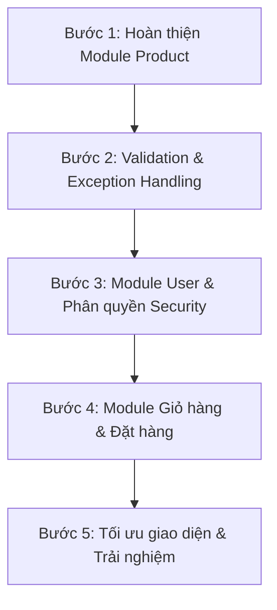

# KẾ HOẠCH CHI TIẾT PHÁT TRIỂN DỰ ÁN LAPTOP SHOP
*Tài liệu hướng dẫn từng bước dành cho lập trình viên - Lộ trình xây dựng hệ thống từ cơ bản đến nâng cao.*

---

Chào em! Với vai trò là một **Senior Developer**, anh đã xem qua toàn bộ cấu trúc mã nguồn hiện tại của dự án. 

### 1. Đánh giá hiện trạng dự án (Project Status Audit)
* **Những gì em đã làm rất tốt:**
  * Cấu trúc thư mục chuẩn Spring Boot (MVC + Layered Architecture).
  * Đã định nghĩa tốt hai Entity cốt lõi: `Category` và `Product`.
  * Triển khai đầy đủ lớp Repository và Service cho cả `Category` và `Product`, có sử dụng DTO (`ProductDTO`) để chuyển đổi dữ liệu qua lại giữa các lớp.
  * Đã cấu hình và viết xong Controller cùng hệ thống giao diện (Thymeleaf) cơ bản cho `Category` (xem danh sách, thêm, sửa, xóa).
* **Điểm cần cải thiện ngay:**
  * Chưa có `ProductController` và giao diện quản lý sản phẩm (Product).
  * Chưa có cơ chế xử lý lỗi tập trung (Global Exception Handling), dễ dẫn đến màn hình lỗi mặc định của Spring (White Label Error Page) khi xảy ra ngoại lệ.
  * Chưa có cơ chế Validation dữ liệu đầu vào ở mức Controller để ngăn chặn dữ liệu rác trước khi đưa xuống Service.

Dưới đây là kế hoạch chi tiết từng bước tiếp theo để em tự tin tự tay code và hoàn thiện dự án này một cách chuyên nghiệp nhất.

---

## PHẦN 2: LỘ TRÌNH PHÁT TRIỂN CHI TIẾT (ROADMAP)



### BƯỚC 1: HOÀN THIỆN MODULE PRODUCT (CONTROLLER & VIEW)
Mục tiêu là hiển thị danh sách laptop, cho phép thêm mới, chỉnh sửa thông tin và xóa laptop.

#### 1. Tạo `ProductController.java`
* **Vị trí:** `com.laptop_shop.controller.ProductController`
* **Nhiệm vụ:**
  * `@GetMapping` (`/products`): Lấy danh sách sản phẩm từ `ProductService` và truyền sang View. Cần truyền thêm danh sách `Category` để hỗ trợ hiển thị tên danh mục.
  * `@GetMapping` (`/products/add`): Hiển thị form thêm sản phẩm. Cần truyền một `ProductDTO` rỗng và danh sách `Category` để người dùng chọn.
  * `@PostMapping` (`/products/add`): Nhận dữ liệu từ form, gọi `productService.save()` để lưu vào database, sau đó redirect về trang danh sách.
  * `@GetMapping` (`/products/edit/{id}`): Lấy thông tin sản phẩm theo ID để đổ vào form chỉnh sửa.
  * `@PostMapping` (`/products/delete/{id}`): Xóa sản phẩm theo ID.

#### 2. Xây dựng các trang giao diện Thymeleaf cho Product
* **Vị trí:** Tạo thư mục `src/main/resources/templates/products/`
* **Các file cần tạo:**
  * `list.html`: Hiển thị bảng danh sách sản phẩm bao gồm: Hình ảnh (dùng thẻ ``), Tên laptop, Danh mục, Giá bán (định dạng tiền tệ VNĐ bằng `#numbers.formatDecimal`), Số lượng, và các nút Hành động (Sửa, Xóa).
  * `add.html` & `edit.html`: Form nhập liệu các trường: Tên sản phẩm, Giá, Số lượng, Mô tả, Đường dẫn ảnh (`imageUrl`), và một thẻ `<select>` để chọn Danh mục (`category`).

---

### BƯỚC 2: VALIDATION VÀ XỬ LÝ NGOẠI LỆ TẬP TRUNG (EXCEPTION HANDLING)
Để ứng dụng không bao giờ bị "sập" hoặc hiện màn hình lỗi thô sơ khi người dùng nhập sai dữ liệu hoặc tìm kiếm sản phẩm không tồn tại.

#### 1. Thêm Validation vào Controller
* Trong `ProductController` và `CategoryController`, tại các hàm xử lý `@PostMapping`, hãy thêm annotation `@Valid` trước DTO/Entity và nhận kết quả kiểm tra thông qua đối tượng `BindingResult`.
* **Ví dụ:**
  ```java
  @PostMapping("/add")
  public String addProduct(@Valid @ModelAttribute("product") ProductDTO productDTO, 
                           BindingResult result, Model model) {
      if (result.hasErrors()) {
          model.addAttribute("categories", categoryService.findAll());
          return "products/add"; // Trả về form để hiển thị lỗi
      }
      productService.save(productDTO);
      return "redirect:/products";
  }
  ```
* Sử dụng các thẻ Thymeleaf như `th:if="${#fields.hasErrors('name')}" th:errors="*{name}"` để hiển thị thông báo lỗi màu đỏ ngay dưới ô nhập liệu.

#### 2. Tạo Bộ xử lý ngoại lệ toàn cục (Global Exception Handler)
* **Vị trí:** `com.laptop_shop.exception.GlobalExceptionHandler`
* **Nhiệm vụ:** Viết một class được đánh dấu `@ControllerAdvice`. Class này sẽ bắt tất cả các ngoại lệ như `ResourceNotFoundException` và điều hướng người dùng đến một trang lỗi thân thiện thay vì hiển thị code Java.
* **Mã mẫu gợi ý:**
  ```java
  @ControllerAdvice
  public class GlobalExceptionHandler {
      
      @ExceptionHandler(ResourceNotFoundException.class)
      public String handleResourceNotFound(ResourceNotFoundException ex, Model model) {
          model.addAttribute("errorMessage", ex.getMessage());
          return "error/404"; // Trang báo lỗi không tìm thấy
      }
  }
  ```

---

### BƯỚC 3: MODULE USER, BẢO MẬT & PHÂN QUYỀN (SPRING SECURITY)
Hệ thống cần phân biệt giữa khách mua hàng và quản trị viên (Admin).

#### 1. Tạo các lớp lưu trữ thông tin User
* **Entity:** `User` (id, username, password, email, fullName, active) và `Role` (id, name). Một User có thể có nhiều Role (Mối quan hệ `@ManyToMany`).
* **Repository:** `UserRepository`, `RoleRepository`.
* **Service:** `UserService` để đăng ký, tìm kiếm người dùng và mã hóa mật khẩu bằng `BCryptPasswordEncoder`.

#### 2. Tích hợp Spring Security & Thymeleaf Extras
* Cấu hình phân quyền:
  * Trang quản lý (`/products/**`, `/categories/**`): Chỉ cho phép tài khoản có quyền `ROLE_ADMIN` truy cập.
  * Trang chủ, trang xem sản phẩm: Cho phép tất cả mọi người (`ROLE_USER` và khách vãng lai).
* Tạo trang Đăng ký (`register.html`) và Đăng nhập (`login.html`).

---

### BƯỚC 4: MODULE GIỎ HÀNG & ĐẶT HÀNG (CART & ORDER)
Đây là trái tim của website bán hàng.

#### 1. Xây dựng thực thể dữ liệu
* **CartItem** (Giỏ hàng tạm thời): Thường lưu trong Session của trình duyệt hoặc trong Database liên kết với User.
* **Order** (Đơn hàng): Lưu thông tin người nhận, địa chỉ, số điện thoại, tổng tiền, ngày đặt, trạng thái đơn hàng (Chờ duyệt, Đang giao, Đã giao).
* **OrderDetail** (Chi tiết đơn hàng): Liên kết giữa `Order` và `Product` để lưu lại giá bán tại thời điểm mua và số lượng mua của từng sản phẩm.

#### 2. Quy trình xử lý nghiệp vụ (Business Flow)
1. Khách hàng click "Thêm vào giỏ" -> Controller thêm sản phẩm vào giỏ hàng.
2. Khách hàng vào trang giỏ hàng (`/cart`) -> Xem danh sách, thay đổi số lượng, click "Thanh toán".
3. Trang thanh toán hiển thị form thông tin nhận hàng -> Click "Xác nhận đặt hàng".
4. Hệ thống tạo `Order`, các `OrderDetail` tương ứng, đồng thời **trừ đi số lượng tồn kho** (`quantity`) của sản phẩm trong database. Nếu số lượng tồn kho không đủ, hiển thị cảnh báo lỗi.

---

## PHẦN 3: LỜI KHUYÊN & NGUYÊN TẮC VÀNG TỪ SENIOR

Để trở thành một lập trình viên giỏi và viết code sạch (clean code), em hãy luôn ghi nhớ các nguyên tắc sau:

1. **Tuân thủ luồng dữ liệu 1 chiều (Data Flow):**
   * Không bao giờ gọi trực tiếp Repository từ Controller hoặc View.
   * `View/DTO` <-> `Controller` <-> `Service` <-> `Repository` <-> `Database`.
2. **DTO vs Entity:**
   * **Entity** là đại diện cho cấu trúc bảng dưới Database. Đừng để dữ liệu từ View trực tiếp thay đổi Entity mà không qua kiểm soát.
   * **DTO (Data Transfer Object)** là thứ dùng để giao tiếp với View/API. Nó chỉ chứa các trường cần thiết. Hãy dùng DTO để bảo vệ Entity khỏi các cuộc tấn công thay đổi dữ liệu trái phép (Mass Assignment Vulnerability).
3. **Viết code có tâm (Clean Code):**
   * Tên biến, tên hàm phải rõ nghĩa (ví dụ: `getProductById` thay vì `getProd`).
   * Không viết các hàm quá dài. Nếu một hàm dài quá 30 dòng, hãy cân nhắc tách nó ra thành các hàm bổ trợ nhỏ hơn.
4. **Hãy kiểm thử (Testing) thường xuyên:**
   * Sau khi viết xong mỗi tính năng ở tầng Service hoặc Controller, hãy chạy ứng dụng và test các trường hợp biên (nhập chữ vào ô số, giá trị âm, chuỗi quá dài) để đảm bảo code hoạt động cực kỳ ổn định.

---
*Chúc em học tốt và sớm hoàn thiện dự án Laptop Shop xuất sắc này! Bất cứ khi nào gặp khó khăn hay cần review code ở bước tiếp theo, hãy cứ hỏi anh nhé!*
